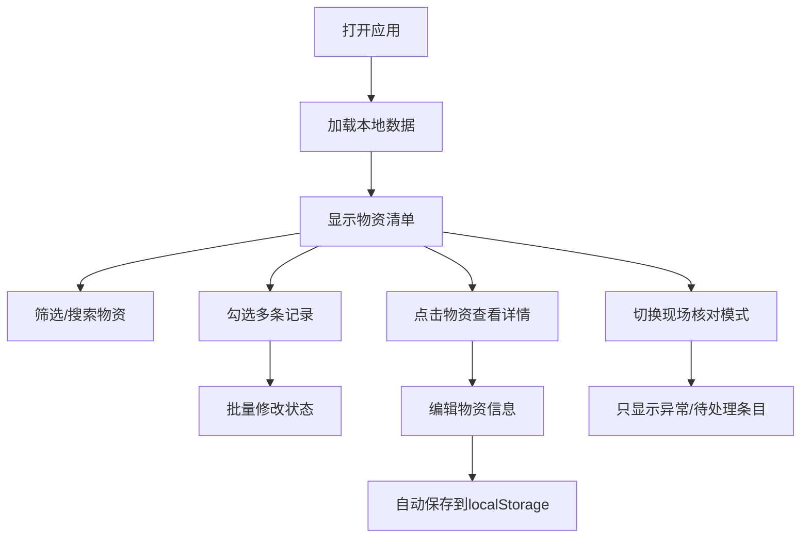

## 1. 产品概述

活动物资管理工作台是一个纯前端单用户应用，用于活动前整理物资清单、分组领取、缺口提醒和现场核对。通过直观的界面设计和高效的操作流程，帮助活动组织者快速管理物资状态、发现缺口问题，确保活动物资准备工作顺利完成。

- 面向单一使用者，无需登录和权限区分
- 数据本地存储，刷新页面不丢失
- 支持批量操作和现场核对模式

## 2. 核心功能

### 2.1 用户角色

| 角色 | 注册方式 | 核心权限 |
|------|----------|----------|
| 管理员 | 无需注册，直接使用 | 全部功能：新增、编辑、删除、筛选、批量操作、现场核对 |

### 2.2 功能模块

1. **物资清单页面**：顶部筛选区、物资列表、右侧详情面板
2. **筛选功能**：按活动、分类、小组、状态多维度筛选
3. **批量操作**：批量标记状态、批量修改数量
4. **详情编辑**：右侧弹出面板，编辑完整物资信息和备注
5. **异常检测**：自动检测数量缺口、责任人缺失、名称重复等问题
6. **现场核对模式**：只显示待处理和异常条目，便于现场检查

### 2.3 页面详情

| 页面名称 | 模块名称 | 功能描述 |
|----------|----------|----------|
| 物资清单页 | 顶部筛选区 | 活动筛选、分类筛选、小组筛选、状态筛选、搜索、新增按钮、现场核对模式开关 |
| 物资清单页 | 物资列表 | 多选框、物资名称、分类、活动、预计数量、实际数量、领取小组、责任人、状态标签、操作按钮 |
| 物资清单页 | 批量操作栏 | 选中数量提示、批量修改状态、取消选择 |
| 物资清单页 | 详情面板 | 右侧滑出面板，完整表单编辑，备注区域，异常提示 |
| 物资清单页 | 异常提示区 | 顶部悬浮提示，显示当前筛选下的异常数量统计 |

## 3. 核心流程

用户打开应用后，首先看到物资清单。可以通过顶部筛选条件快速定位需要的物资，点击任意物资在右侧打开详情面板进行编辑。需要批量处理时，先勾选多条记录，再通过批量操作栏统一修改状态。切换到现场核对模式后，只显示需要关注的条目，便于在活动现场快速核对。所有数据自动保存到本地存储。

## 4. 用户界面设计

### 4.1 设计风格

- **主色调**：深靛蓝 (#1e3a5f) 作为主色，搭配琥珀橙 (#f59e0b) 作为强调色，用于状态标签和操作按钮
- **辅助色**：翠绿 (#10b981) 表示正常/已完成，朱红 (#ef4444) 表示异常/缺口，灰蓝 (#64748b) 表示次要信息
- **按钮风格**：圆角中等 (6px)，悬停时有轻微阴影和颜色加深效果
- **字体**：使用思源黑体 (Noto Sans SC) 作为中文字体，配合系统字体栈，保证清晰易读
- **布局风格**：顶部固定筛选栏 + 左侧主内容区 + 右侧滑出详情面板，简洁高效
- **图标风格**：使用简洁的线性图标，统一风格，颜色与文字一致

### 4.2 页面设计概述

| 页面名称 | 模块名称 | UI 元素 |
|----------|----------|---------|
| 物资清单页 | 顶部筛选区 | 白色背景卡片，下拉选择框、搜索框、按钮组，浅灰边框，阴影柔和 |
| 物资清单页 | 物资列表 | 斑马纹表格行，悬停高亮，状态标签带圆角和背景色，数量差异用颜色区分 |
| 物资清单页 | 批量操作栏 | 底部固定，深蓝色背景，白色文字，显示选中数量和操作按钮 |
| 物资清单页 | 详情面板 | 右侧滑入，白色背景，阴影明显，顶部标题栏，表单字段分组，底部操作按钮 |
| 物资清单页 | 异常提示 | 顶部通知条，琥珀色背景，黑色文字，显示异常统计和查看详情链接 |

### 4.3 响应式

- 桌面端优先设计 (1280px 以上)
- 平板端 (768px - 1279px)：详情面板改为底部滑出，筛选条件换行排列
- 移动端 (小于 768px)：列表改为卡片式布局，筛选条件折叠显示

### 4.4 动效设计

- 详情面板滑入/滑出：0.3s ease 过渡
- 行悬停：0.15s 背景色过渡
- 状态标签切换：颜色渐变 + 轻微缩放
- 按钮点击：轻微下沉效果
- 批量操作提示：淡入淡出动画
