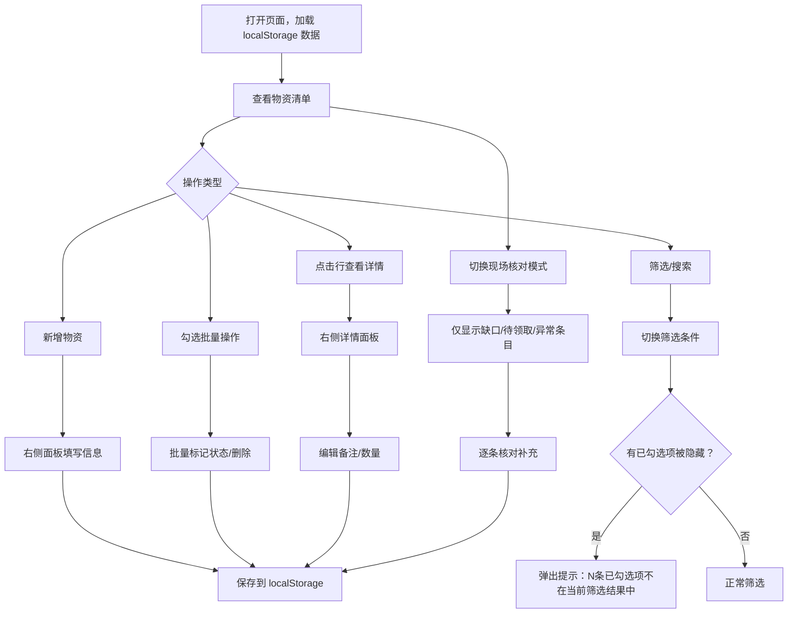

## 1. 产品概述

活动物资管理工作台——面向活动筹备人员的纯前端单页应用，用于活动前整理物资清单、分组领取、缺口提醒和现场核对。无需登录，数据保存在浏览器本地，刷新后可恢复。

- 解决活动物资分散、领取状态不清、缺口遗漏等问题
- 目标用户：活动筹备组单人使用，快速录入、批量核对、现场检查

## 2. 核心功能

### 2.1 用户角色

无需角色区分，单用户直接使用。

### 2.2 功能模块

1. **物资清单页**：顶部筛选区、物资列表、右侧详情面板、批量操作栏、问题提醒、现场核对模式切换

### 2.3 页面详情

| 页面名称 | 模块名称 | 功能描述 |
|----------|----------|----------|
| 物资清单页 | 顶部筛选区 | 按活动、分类、领取小组、状态筛选，支持关键词搜索；切换筛选时保留已勾选但给出提示 |
| 物资清单页 | 物资列表 | 单列清单展示所有物资，每行显示名称、分类、活动、预计/实际数量、小组、责任人、状态；支持勾选、行内快速编辑数量、点击展开详情面板 |
| 物资清单页 | 新增/编辑表单 | 弹出右侧面板填写物资信息（名称、分类、所属活动、预计数量、实际数量、领取小组、责任人、状态、备注） |
| 物资清单页 | 批量操作栏 | 勾选多条后出现浮动操作栏：批量标记领取状态、批量删除；切换筛选时提示被隐藏的已勾选项 |
| 物资清单页 | 问题提醒区 | 自动检测：实际<预计、责任人空、同活动物资名重复、已领取但实际数量为0；以徽标/列表形式展示 |
| 物资清单页 | 现场核对模式 | 一键切换，仅显示缺口（实际<预计）、待领取、备注异常的条目，便于现场快速核对 |

## 3. 核心流程

用户打开页面 → 查看物资清单 → 通过筛选区定位目标物资 → 勾选多条记录 → 批量标记领取状态 → 切换到现场核对模式检查缺口 → 补充备注和实际数量 → 数据自动保存到 localStorage

## 4. 用户界面设计

### 4.1 设计风格

- 主色：深青灰（#1a1a2e）搭配暖橙强调色（#e8703a）
- 辅助色：浅灰背景（#f5f5f0）、白色卡片、状态色（绿/黄/红/灰）
- 按钮：圆角（8px），主操作用实心暖橙，次操作用描边
- 字体：Noto Sans SC（中文），搭配 DM Sans（英文/数字）
- 布局：顶部固定筛选栏 + 中间单列清单 + 右侧滑出详情面板
- 图标：lucide-react 图标库
- 状态标签：彩色胶囊标签，各状态对应不同颜色

### 4.2 页面设计概览

| 页面名称 | 模块名称 | UI 元素 |
|----------|----------|---------|
| 物资清单页 | 顶部筛选区 | 横向排列下拉筛选器（活动/分类/小组/状态）+ 搜索输入框 + 现场核对模式开关；深色背景，白色文字 |
| 物资清单页 | 物资列表 | 白色卡片行，左侧勾选框，行内显示关键字段；状态用彩色标签；hover 时行背景微变；选中行左侧显示橙色边条 |
| 物资清单页 | 批量操作栏 | 底部固定浮动栏，显示已选数量，包含状态切换下拉和删除按钮；暖橙色调 |
| 物资清单页 | 右侧详情面板 | 从右侧滑入，宽 400px，覆盖在列表上方；表单字段垂直排列，底部保存/取消按钮 |
| 物资清单页 | 问题提醒区 | 顶部筛选区下方，横向滚动的问题卡片，每张卡片显示问题类型和数量，点击可筛选到对应条目 |
| 物资清单页 | 现场核对模式 | 切换后列表背景变为深色，条目精简显示，缺口项用红色高亮数量差异 |

### 4.3 响应式

桌面优先设计，最小宽度 1024px。右侧面板在窄屏下改为全屏覆盖。

### 4.4 3D 场景

不适用。
