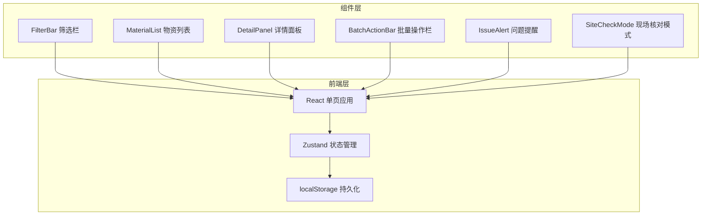
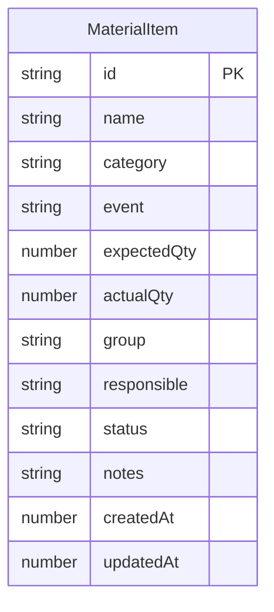

## 1. 架构设计



纯前端架构，无后端服务。所有数据通过 Zustand store 管理，自动同步到 localStorage。

## 2. 技术说明

- 前端：React@18 + TypeScript + Tailwind CSS@3 + Vite
- 初始化工具：vite-init（react-ts 模板）
- 状态管理：Zustand（含 localStorage 中间件）
- 后端：无
- 数据库：无（使用 localStorage）
- 图标：lucide-react

## 3. 路由定义

| 路由 | 用途 |
|------|------|
| / | 物资清单主页（唯一页面，所有功能在同一页面内完成） |

## 4. API 定义

无后端 API。

## 5. 服务器架构图

不适用。

## 6. 数据模型

### 6.1 数据模型定义



### 6.2 数据定义

```typescript
type MaterialStatus =
  | "pending"
  | "to_pickup"
  | "partial_pickedup"
  | "pickedup"
  | "gap_pending"
  | "deferred"

interface MaterialItem {
  id: string
  name: string
  category: string
  event: string
  expectedQty: number
  actualQty: number
  group: string
  responsible: string
  status: MaterialStatus
  notes: string
  createdAt: number
  updatedAt: number
}

interface FilterState {
  event: string
  category: string
  group: string
  status: string
  keyword: string
}

interface IssueItem {
  type: "qty_gap" | "no_responsible" | "duplicate_name" | "pickedup_zero"
  materialIds: string[]
  message: string
}
```

状态映射：
- pending → 待准备
- to_pickup → 待领取
- partial_pickedup → 部分领取
- pickedup → 已领取
- gap_pending → 缺口待补
- deferred → 暂缓
