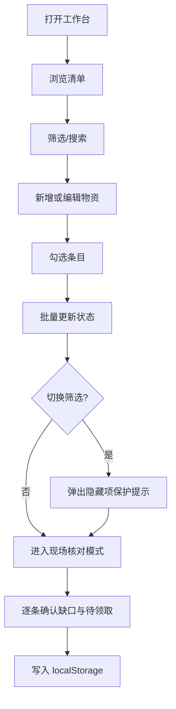

# 活动物资工作台 PRD

## 1. 产品概述
一个面向单人使用的纯前端活动物资管理工作台，用于活动前整理物资清单、分组领取、缺口提醒和现场核对。
- 解决活动筹备阶段物资台账分散、缺口难发现、现场核对慢的问题，目标用户是负责活动后勤的执行人员。
- 通过本地存储（localStorage）实现免登录、即开即用，提升单人物资协调效率。

## 2. 核心功能

### 2.1 用户角色
本产品仅服务单一执行人，不做角色区分，无需登录。

### 2.2 功能模块
1. **工作台主页**：顶部筛选区、单列物资清单、批量操作工具条、详情侧滑面板、异常提醒徽标、现场核对模式开关。

### 2.3 页面详情
| 页面名称 | 模块名称 | 功能描述 |
|----------|----------|----------|
| 工作台主页 | 顶部筛选区 | 按活动、分类、领取小组、状态进行筛选；支持关键字搜索；展示当前结果数。 |
| 工作台主页 | 工具条 | 新增物资、批量标记状态（待领取 / 部分领取 / 已领取 / 缺口待补 / 暂缓）、清除筛选；当筛选切换会隐藏已勾选项时弹出黄色提示，禁止误改隐藏项。 |
| 工作台主页 | 单列物资清单 | 每行展示名称、分类、所属活动、预计/实际数量、领取小组、责任人、状态徽标、备注摘要；支持勾选、点击展开详情、内联编辑数量与状态。 |
| 工作台主页 | 详情侧滑面板 | 展示并编辑全部字段（名称、分类、所属活动、预计/实际数量、领取小组、责任人、状态、备注）；显示该条记录所有异常告警；提供保存与删除。 |
| 工作台主页 | 异常告警 | 自动检测：实际数量<预计数量、责任人为空、同活动下名称重复、状态=已领取但实际数量=0；以徽标和列表形式提示。 |
| 工作台主页 | 现场核对模式 | 仅展示状态为缺口待补、待领取、部分领取或带异常备注的条目；支持快速勾选确认；退出时回到完整清单。 |
| 工作台主页 | 数据持久化 | 所有变更写入 localStorage，刷新后自动恢复；提供导出/重置示例数据按钮。 |

## 3. 核心流程
执行人打开工作台 → 浏览/筛选清单 → 新增或编辑物资 → 勾选多条进行批量核对 → 切换筛选时收到隐藏项保护提示 → 进入现场核对模式核对缺口与待领取 → 数据自动写入 localStorage。

## 4. 用户界面设计

### 4.1 设计风格
- 主色：深墨绿 #1F3A34；辅色：暖琥珀 #D9A441；中性灰 #F4F1EA / #E5E0D5；告警 #C0432F。
- 风格定位：编辑部式（editorial）后勤台账，骨子里是“纸质工单 + 数字徽章”的混搭，强调字距、分隔线和单色徽标。
- 字体：标题使用 "Fraunces"（serif，Google Fonts），正文使用 "IBM Plex Sans"，数字使用 "IBM Plex Mono"。
- 按钮：方角 2px 边框，悬停时反色填充；状态徽标使用胶囊形点缀竖条色块。
- 布局：顶部 sticky 筛选条 + 主体单列卡片清单 + 右侧 420px 抽屉详情；主体最大宽度 1080px。
- 图标：使用 lucide-react 线性图标，关键警示位置使用单色 emoji 风格徽标（⚠️、◷、✓）。

### 4.2 页面设计概览
| 页面名称 | 模块名称 | UI 元素 |
|----------|----------|---------|
| 工作台主页 | 顶部筛选区 | sticky 容器，深墨绿底，米色文字；筛选项使用下拉胶囊；右侧显示结果计数（IBM Plex Mono）。 |
| 工作台主页 | 工具条 | 米色背景，左侧批量操作下拉，右侧新增按钮（琥珀色填充）；隐藏项提示使用黄底深色文字横幅。 |
| 工作台主页 | 物资清单 | 单列卡片，左侧 4px 状态色块，右侧关键数字大号 mono 字体；hover 时显示编辑/详情入口。 |
| 工作台主页 | 详情面板 | 右侧抽屉，纸质质感（淡米色 + 细网格纹理），表单使用下划线输入；底部固定保存/删除按钮。 |
| 工作台主页 | 现场核对模式 | 顶部出现红色提示条，列表只剩异常项，行高加大并显示快速“确认领取/记缺口”双按钮。 |

### 4.3 响应式
桌面优先，1280px 主断点；移动端（≤768px）筛选条折叠为抽屉，详情面板改为全屏覆盖。

