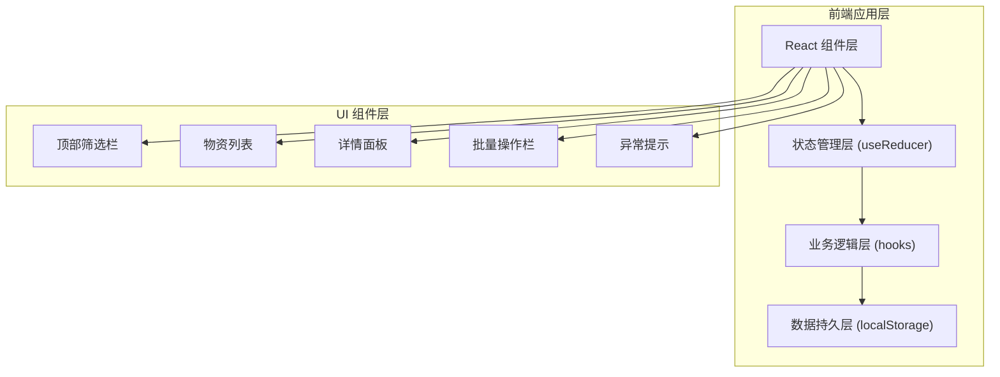
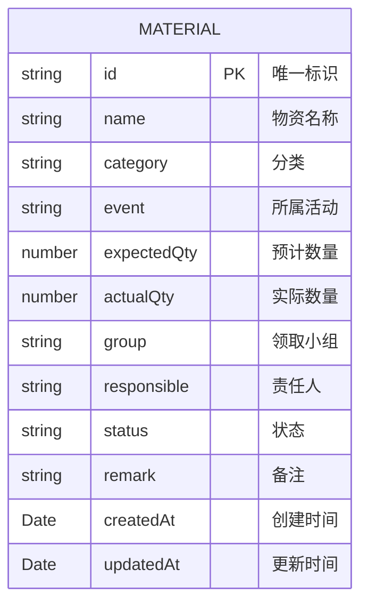

## 1. 架构设计



## 2. 技术描述

- **前端框架**：React 18 + TypeScript
- **构建工具**：Vite 5
- **样式方案**：Tailwind CSS 3
- **状态管理**：React useReducer + Context
- **数据存储**：localStorage (无后端)
- **图标库**：Lucide React
- **初始化方式**：npm create vite@latest

## 3. 路由定义

| 路由 | 用途 |
|------|------|
| / | 物资清单主页面（单页应用，无其他路由） |

## 4. 数据模型

### 4.1 数据模型定义



### 4.2 状态枚举

```typescript
type MaterialStatus = 
  | 'pending'      // 待准备
  | 'ready'        // 待领取
  | 'partial'      // 部分领取
  | 'received'     // 已领取
  | 'shortage'     // 缺口待补
  | 'suspended';   // 暂缓
```

### 4.3 异常类型

```typescript
type AnomalyType = 
  | 'quantity_shortage'   // 实际数量 < 预计数量
  | 'no_responsible'      // 责任人为空
  | 'duplicate_name'      // 同一活动下名称重复
  | 'received_zero';      // 已领取但实际数量为0
```

### 4.4 筛选条件类型

```typescript
interface FilterState {
  event: string;
  category: string;
  group: string;
  status: MaterialStatus | '';
  search: string;
  siteCheckMode: boolean;
}
```

## 5. 核心功能模块

### 5.1 useMaterials Hook
- 管理物资数据的 CRUD 操作
- 处理批量更新
- 与 localStorage 同步
- 异常检测逻辑

### 5.2 useFilters Hook
- 管理筛选条件状态
- 执行筛选逻辑
- 处理筛选与批量选择的边界问题

### 5.3 组件结构
- `App.tsx` - 主应用入口，Provider 包装
- `components/FilterBar.tsx` - 顶部筛选栏
- `components/MaterialList.tsx` - 物资列表
- `components/MaterialItem.tsx` - 单条物资记录
- `components/DetailPanel.tsx` - 右侧详情面板
- `components/BatchActionBar.tsx` - 批量操作栏
- `components/AnomalyBanner.tsx` - 异常提示条
- `components/NewMaterialModal.tsx` - 新增物资弹窗

## 6. 关键技术点

### 6.1 筛选与批量操作边界
- 维护完整的选中 ID 集合
- 切换筛选条件时，保留所有选中项
- 批量操作时，明确提示操作的数量（包括隐藏项）
- 提供"仅操作可见项"和"操作全部选中项"两种选择

### 6.2 异常检测算法
- 遍历所有物资记录
- 按活动分组检测名称重复
- 检查各项异常条件
- 实时更新异常统计

### 6.3 数据持久化
- 使用 useReducer 的中间件模式
- 每次状态变更后自动同步到 localStorage
- 初始化时从 localStorage 加载
- 提供默认示例数据

### 6.4 现场核对模式
- 开启后自动过滤出：缺口待补、待领取、部分领取状态 + 存在异常的记录
- 突出显示数量差异和异常信息
- 简化界面，只保留核心操作
