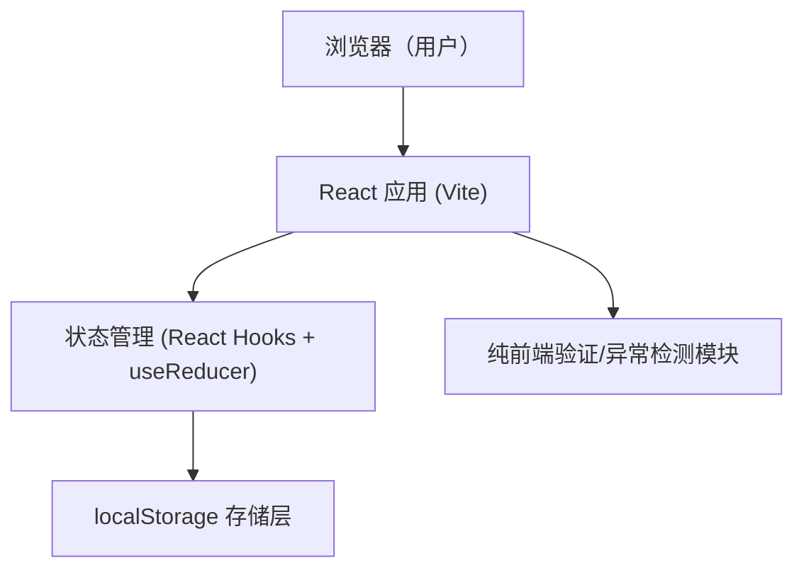
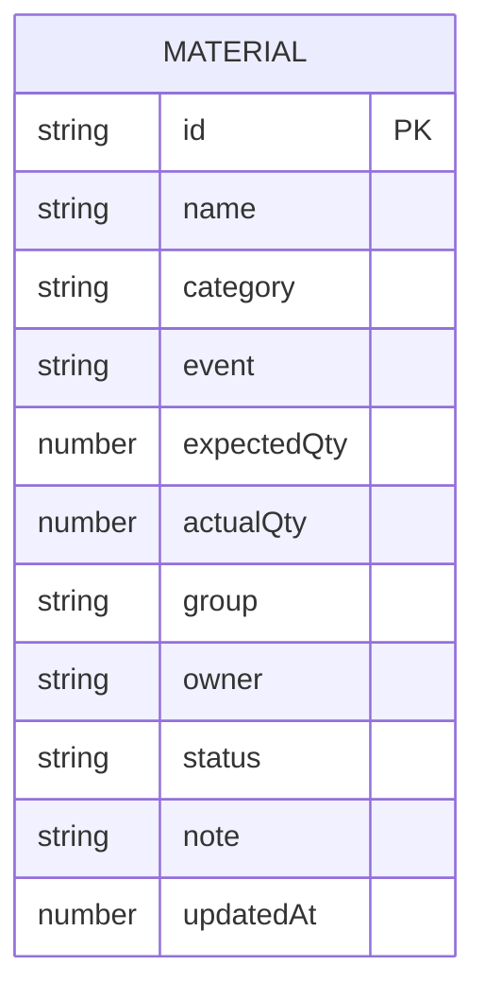

# 活动物资工作台 技术架构

## 1. 架构设计

## 2. 技术说明
- 前端：React@18 + Vite@5 + TypeScript
- 样式：原生 CSS（CSS 变量 + 模块化 class），不引入 UI 组件库
- 图标：lucide-react
- 字体：Google Fonts（Fraunces、IBM Plex Sans、IBM Plex Mono）
- 持久化：浏览器 localStorage（key：`event_materials_v1`）
- 后端：无
- 数据库：无（首次进入时载入示例数据）

## 3. 路由定义
单页应用，无路由切换。

| 路由 | 用途 |
|------|------|
| / | 工作台主页（顶部筛选 + 单列清单 + 右侧详情抽屉） |

## 4. 数据模型

### 4.1 模型定义

### 4.2 字段说明
- id：uuid
- status 枚举：`pending`(待准备)、`to_pick`(待领取)、`partial`(部分领取)、`picked`(已领取)、`shortage`(缺口待补)、`hold`(暂缓)
- 异常检测规则：
  1. actualQty < expectedQty → 数量不足
  2. owner 为空 → 责任人缺失
  3. 同 event 下 name 重复 → 名称重复
  4. status === picked && actualQty === 0 → 状态与数量冲突
- 持久化：每次状态变更后将 materials 数组 JSON.stringify 写入 localStorage。

## 5. 关键交互细节
- 筛选切换保护：组件内维护 `selectedIds`，每次筛选条件变更时计算 `hiddenSelected = selectedIds ∩ filteredOut`；若非空则显示横幅“X 条已勾选项被当前筛选隐藏，批量操作不会影响它们”。批量操作仅作用于 `selectedIds ∩ visibleIds`。
- 现场核对模式：使用独立 `inspectionMode` 布尔，开启后筛选条仅保留搜索框，列表过滤函数切换为异常视图。
- 详情面板：受控表单，保存时校验后写回 reducer。
