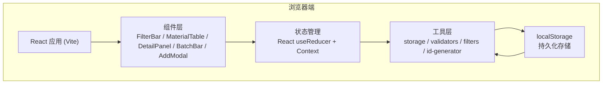

# 活动物资管理工作台 技术架构

## 1. 架构设计

纯前端单页面应用，无后端服务。数据持久化使用浏览器 localStorage。



## 2. 技术说明

- **前端框架**: React 18 + TypeScript
- **构建工具**: Vite 6
- **样式方案**: Tailwind CSS 3（无额外组件库，全部自定义组件）
- **图标**: lucide-react
- **初始化工具**: npm create vite@latest
- **后端**: 无
- **数据库**: localStorage（键名: `event-materials-v1`）
- **数据模拟**: 首次加载时若无数据，注入若干示例数据便于体验

## 3. 目录结构

```
src/
├── main.tsx              # 入口
├── App.tsx               # 根组件，布局编排
├── index.css             # Tailwind + 全局样式 + CSS 变量
├── types/
│   └── index.ts          # Material、Filter、Status 等类型定义
├── store/
│   └── MaterialContext.tsx  # Context + reducer，全局状态
├── hooks/
│   └── useMaterials.ts   # 封装 Context 调用的自定义 hook
├── utils/
│   ├── storage.ts        # localStorage 读写封装
│   ├── validators.ts     # 异常检测逻辑
│   ├── filters.ts        # 筛选逻辑
│   └── id.ts             # ID 生成
├── components/
│   ├── FilterBar.tsx     # 顶部筛选区
│   ├── MaterialTable.tsx # 清单表格
│   ├── DetailPanel.tsx   # 右侧详情抽屉
│   ├── BatchActionBar.tsx # 批量操作栏
│   ├── AddMaterialModal.tsx # 新增弹窗
│   ├── SelectionBanner.tsx # 筛选隐藏选中提示横幅
│   ├── StatusBadge.tsx   # 状态标签组件
│   └── IconButton.tsx    # 图标按钮
└── constants/
    └── index.ts          # 状态枚举、分类选项等常量
```

## 4. 路由定义

单页面应用，无路由。URL 不随状态变化，筛选状态仅存在内存中。

| 路由 | 用途 |
|------|------|
| `/` | 唯一页面，承载全部功能 |

## 5. 数据模型

### 5.1 类型定义

```typescript
type Status = '待准备' | '待领取' | '部分领取' | '已领取' | '缺口待补' | '暂缓';

interface Material {
  id: string;
  name: string;
  category: string;
  activity: string;
  expectedQty: number;
  actualQty: number;
  group: string;
  owner: string;
  status: Status;
  remark: string;
  createdAt: number;
  updatedAt: number;
}

interface FilterState {
  activity: string;       // '' 表示全部
  group: string;          // '' 表示全部
  status: Status[];       // [] 表示全部
  keyword: string;        // 搜索名称/备注
  onsiteMode: boolean;    // 现场核对模式
}

interface AppState {
  materials: Material[];
  filter: FilterState;
  selectedIds: Set<string>;   // 全局选中集合（独立于筛选）
  activeDetailId: string | null; // 当前打开详情的记录 id
  showAddModal: boolean;
}
```

### 5.2 异常检测输出结构

```typescript
interface ValidationIssue {
  type: 'qty_gap' | 'no_owner' | 'duplicate_name' | 'claimed_zero' | 'remark_flag';
  message: string;
  level: 'warning' | 'error';
}
```

每个 Material 通过 `getIssues(material, allMaterials)` 计算其 ValidationIssue 列表。

### 5.3 localStorage 数据格式

```json
{
  "version": 1,
  "materials": [ ...Material[] ]
}
```

仅持久化 materials 数组，筛选/选中/UI 状态不持久化。

## 6. 关键状态管理逻辑

### 6.1 Reducer Actions

| Action | 说明 |
|--------|------|
| `LOAD_MATERIALS` | 初始化加载 |
| `ADD_MATERIAL` | 新增一条 |
| `UPDATE_MATERIAL` | 更新单条 |
| `DELETE_MATERIAL` | 删除单条 |
| `BATCH_UPDATE` | 批量更新（status/group/owner），传入 ids 集合 |
| `SET_FILTER` | 更新筛选条件 |
| `TOGGLE_SELECT` | 切换单条选中 |
| `SELECT_ALL_VISIBLE` | 全选当前筛选结果内的记录 |
| `CLEAR_SELECTION` | 清空选中 |
| `CLEAR_HIDDEN_SELECTION` | 清除不在当前筛选结果中的选中项 |
| `SET_ACTIVE_DETAIL` | 打开/关闭详情面板 |
| `TOGGLE_ADD_MODAL` | 打开/关闭新增弹窗 |

### 6.2 筛选后可见记录计算

```
visibleIds = materials
  .filter(m => filter.activity ? m.activity === filter.activity : true)
  .filter(m => filter.group ? m.group === filter.group : true)
  .filter(m => filter.status.length ? filter.status.includes(m.status) : true)
  .filter(m => filter.keyword ? matchKeyword(m) : true)
  .filter(m => filter.onsiteMode ? hasIssues(m) : true)
  .map(m => m.id)
```

### 6.3 选中隐藏提示逻辑

```
hiddenSelectedCount = selectedIds.size - intersection(selectedIds, visibleIds).size
```

当 `hiddenSelectedCount > 0` 时显示 SelectionBanner。

### 6.4 批量操作边界保证

- `BATCH_UPDATE` 直接操作 `selectedIds` 集合中的所有 id，不管它们是否在 `visibleIds` 中
- 执行前弹窗明确显示：`本次操作将影响 ${selectedIds.size} 条记录（含 ${hiddenSelectedCount} 条当前筛选外的记录）`
- 表头全选复选框：
  - 勾选时：将 visibleIds 中未选中的加入 selectedIds
  - 取消时：将 visibleIds 从 selectedIds 中移除
  - indeterminate 状态：visibleIds 部分在 selectedIds 中
